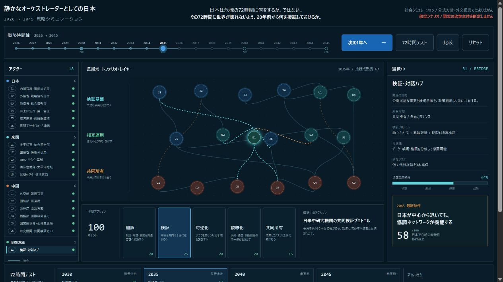

# 静かなオーケストレーターとしての日本

> 日本は危機の72時間に何をするか、ではない。
>
> **その72時間に世界が壊れないよう、20年前から何を接続しておけるか。**

`quiet-orchestrator-japan` は、日本が覇権者や中立の仲裁者ではなく、翻訳・検証・可逆化・複線化・共同所有の基盤として各国、企業、大学、研究機関、AI、宇宙、エネルギーを接続できるかを比較する社会シミュレーションです。

これは日本政府の公式方針、将来予測、特定国への攻撃帰属、外交・防衛政策の提言ではありません。実在組織は公開された役割を抽象化する参照であり、内部意思決定や将来行動を再現しません。



## 2045年のゴール

成功条件は、日本の発言力や中心性が上がることではありません。

**2045年に日本が中心から退いても、翻訳・検証・相互運用のネットワークが自律的に機能すること**を成功とします。監視の集中、機密漏洩、日本への依存、同盟や多国間制度の空洞化を生む場合、この構想は失敗です。

## 触ってみる

Node.js 20以降とnpmを使います。ライブAPI、APIキー、クラウド接続は不要です。

```powershell
cd app
npm install
npm run dev -- --host 127.0.0.1
```

表示されたローカルURLをブラウザで開きます。Codex内蔵プレビューでは別のhost指定を使いますが、通常のローカル実行はループバックへ限定します。

```powershell
npm test
npm run build
npm run test:sites
```

現在のMVPは次を実装しています。

- 2026年から2045年までの決定論的な年次シミュレーション
- 18の論理主体と、その接続成熟度・依存リスクの可視化
- 翻訳、検証、可逆化、複線化、共同所有の5つの年次アクション
- 2030、2035、2040、2045年の72時間ストレステスト
- 協調資本、検証能力、相互運用性、戦略的自律性、国内正統性の能力指標
- 権力集中、監視化、単一依存のリスク指標
- 同盟代理、単独仲介、静かなオーケストレーションの比較表示
- 同じ状態と施策から同じ結果を返す再現可能なローカルエンジン

現在は、5施策による**全体指標の差**までを実装した公開基準点です。接続線はまだ接続ごとの状態を持たず、主体ごとの利害・制約も行動差へ反映していません。できていること、実測値、結論に使えないことは[実行結果](RESULTS.md)に、接続単位のシミュレーターへ進む順序は[ロードマップ](ROADMAP.md)に明記しています。

## 二つの時間軸

| 時間軸 | 役割 | 操作 |
|---|---|---|
| 2026〜2045年 | 人材、制度、共同研究、検証網、代替経路、共同所有を育てる本編 | 1ターン1年 |
| 72時間 | その時点の基盤が複合危機で機能するか壊して確かめる試験 | 1ターン6時間 × 12 |

72時間は本編ではありません。2030、2035、2040、2045年の節目で長期投資を検査する、入れ子の危機演習です。

## 遊び方

1. 年間アクションから、今年強化するオーケストレーション機能を選ぶ。
2. 「次の1年へ」で能力・リスク・接続成熟度を更新する。
3. 節目または任意の年に「72時間テスト」を実行する。
4. 誤帰属回避、協調継続、民間保護の結果を確認する。
5. 「比較」で、調整方式だけを変えた場合の継続性と依存を比べる。
6. 2045年に、日本不在時の継続性が十分かを評価する。

初期表示は、作品の構造が分かる2035年のデモ状態です。「リセット」で2026年から開始できます。

## 日本が静かに行う5つのこと

| 機能 | 長期的に接続するもの | 成功の観測 |
|---|---|---|
| 翻訳 | 軍事、外交、法執行、企業、研究者、AIの用語と証拠基準 | 同じ主張の意味と確信度を比較できる |
| 検証 | 生データを集中させない共同検証プロトコル | 米中を含む複数主体が最低限の事実を共有する |
| 可逆化 | 段階的対応、共同停止条件、期限付き権限 | 不可逆行動へ進む前に戻れる |
| 複線化 | 通信、宇宙、海洋、エネルギー、供給網、判断経路 | 一つの回線が止まっても協調が残る |
| 共同所有 | 第三国、大学、企業、国際機関を含む多元ガバナンス | 日本が抜けても制度と便益が残る |

日本は他国を命令しません。異なる主体が判断権を保持したまま、共有できる事実と可逆的行動を増やすための接続をつくります。

## 単一の協調失敗

抽象的な国家論を避けるため、危機試験で追う失敗を一つに固定します。

**検証前の攻撃帰属が、政策判断を先回りすること。**

南西諸島周辺で海上接触、通信障害、港湾・金融へのDDoS、測位異常、真偽不明映像、保険料上昇、同盟要請などが重なります。真因はワールドエンジンだけが持ち、各主体には断片しか見せません。

入力領域は海洋安全保障とサイバー安全保障に固定します。宇宙・電磁波、経済安全保障、情報・外交は、両者の間で証拠、損失、能力、物語を運ぶ接続領域です。

## 18の論理主体

米国と中国を一つの人格にせず、日本も一枚岩にしません。

| 系統 | 数 | MVPの抽象役割 |
|---|---:|---|
| 日本 | 6 | 政治調整、外交、防衛、海上法執行、経済・民間、独立検証 |
| 米国 | 5 | 軍事、外交、サイバー、海上法執行、民間インフラ |
| 中国 | 6 | 外交、国防、海警、経済、サイバー・情報、研究機関 |
| BRIDGE | 1 | 第三国・国際機関・研究者による検証と対話の共同ハブ |

実在組織との対応、圧縮した論理ノード、通信制約は[シミュレーション契約](simulation-contract.md)に記録しています。

## 公平性と反証

「日本なら成功する」という結論は埋め込みません。

- 全条件で同じ初期状態、情報予算、行動回数を使う。
- 日本だけに真因、追加情報、強い権限を与えない。
- 中国を非合理、米国を完全情報、日本を常に善意として扱わない。
- 日本不在時の継続性を独立指標にする。
- 協調能力と同時に、権力集中、監視化、単一依存を測る。
- 条件や係数で結論が反転する場合は仮説を縮小・棄却する。

現在のMVPはルールの見える決定論モデルです。LLMは中核状態を決めません。将来エージェント推論を加える場合も、決定論エンジンと分離し、同じseedで感度を測ります。

## 実装構成

```text
app/
  src/
    simulation.js     決定論的な状態遷移、施策、評価
    App.jsx            操作可能なUIと比較表示
    styles.css         選択済みデザインシステム
  tests/
    simulation.test.mjs
    sites-worker.test.mjs
docs/
  adr/                 設計判断記録
  design/              選択済みUIコンセプト
  images/              実装プレビュー
```

設計上、シミュレーション状態と描画を分離しています。保存・比較・将来の推論アダプターは、DOMやネットワーク描画を状態の正本にしません。

## 公開根拠

概念の公開原典は、ハッカソン公式サイトからリンクされる片山俊大氏の「メタ安全保障」構想ペーパー Version 1.0に限定します。

1. [AIエージェント社会シミュレーションハッカソン Vol.2 公式サイト](https://hackathon.automata-lab.jp/)
2. [メタ安全保障 構想ペーパー Version 1.0](https://prtimes.jp/a/?f=d80352-184-caedebb354dd205d5811c599da74761b.pdf)

政府・公的機関のURLは、シナリオの現実性、領域名、公開された組織役割を確認する参照資料です。公式方針への賛同や実際の指揮系統の再現を意味しません。

## 文書

- [シミュレーション契約](simulation-contract.md)
- [ロードマップ](ROADMAP.md)
- [実行結果](RESULTS.md)
- [OSINT根拠台帳](evidence.md)
- [公式URL台帳](official-sources.md)
- [ADR一覧](docs/adr/README.md)
- [デザインシステム](docs/design-system.md)
- [脅威モデル](docs/threat-model.md)
- [GitHub設定計画](docs/github-settings-plan.md)
- [公開準備チェック](PUBLIC_READY.md)
- [出典・権利・責任境界](NOTICE.md)
- [セキュリティ方針](SECURITY.md)
- [コントリビューションガイド](CONTRIBUTING.md)

## 制約

- これは社会シミュレーションの仮説であり、現実の戦争予測や政策評価ではない。
- 論理主体は公開役割の抽象であり、実在組織の意思・能力・将来行動を断定しない。
- 現実の攻撃帰属、軍事作戦立案、外交・防衛政策の採否に直接使用しない。
- 秘密情報、個人情報、非公開運用情報を入力しない。
- 現在の数値・係数・デモ結果は架空であり、経験的に較正された確率ではない。

## ライセンス

コードと独自文書は[MIT License](LICENSE)です。第三者資料はURLと短い要約だけを収録し、原典ファイルを再配布しません。詳細は[NOTICE](NOTICE.md)を参照してください。

---

中心仮説「日本を覇権者ではなく、多様な主体を束ねる静かなオーケストレーターとして検証する」はユーザー提案です。二重時間軸、2045年の成功条件、南西諸島の危機試験、比較条件、指標、反証条件は壁打ちから具体化した設計案であり、公式見解ではありません。
