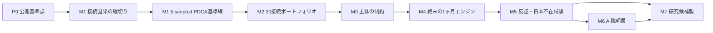

# ロードマップ｜2045年に日本を外せるところまで作る

## ゴール

年次投資から接続状態、ネットワーク能力、終末の1ヶ月、日本不在試験までを一つの因果鎖として再生し、中心仮説が成立する条件と反転する条件を同じ画面で比較できるようにする。

設計の正本は[プロダクト設計](docs/product-architecture.md)、実験上の不変条件は[シミュレーション契約](simulation-contract.md)に置く。

## 現在地｜P0・P1 `main`統合済み + M1因果台帳drawer

状態: **P0・P1因果縦切りは`main`へ統合済み / M1因果台帳drawerとUIゲート同一HEAD証拠を閉じ、次はM2**

| 実装済み | 未実装 |
|---|---|
| 2026〜2045年の決定論的年次更新 | 全20接続を投資可能にする校正 |
| 18主体、20接続の安定IDと共通schema | 主体ごとの能力・利害・制約 |
| `B1 ↔ C6`の状態遷移、差分preview、因果台帳、全履歴drawer | 全接続の状態遷移 |
| 5施策による全体指標の差 | 投資先による施策効果の差 |
| 30日・6時間×120ターンという契約 | 120ターンのイベント列 |
| 2030、2035、2040、2045年の集約試験 | 何ターン目に何が効いたかの再生 |
| 3戦略の比較表示 | A〜Eを同じエンジン・seedで再実行 |
| 2045年の継続性スコア | 日本ノード除去後の実動テスト |

P1の代表接続を含め、現時点の数値は架空であり、構想の有効性を示す実証結果ではない。

## 実装順序

M1〜M5が中核であり、M6は任意である。AIなしでもM7へ到達できる。

ハッカソン提出の時間制約に対しては、M2〜M5を未検証のまま前倒しせず、M1の代表接続へM6で必要になる安全境界だけを先行適用する`M1.5`を置く。これはAI実装ではなく、固定action表を使うscripted Policy EngineでPDCA、検証、receipt、再現性を実測する基準線である。

## M1.5｜scripted Policy EngineによるPDCA基準線

優先度: **Today / Must for hackathon demo**

固定seedと固定action表を使う3主体のscripted Policy Engineが、許可済みactionを順番に提案する。シミュレーター自身が`Plan → Do → Check → Act`を回すが、提案は毎手未信頼入力として検証し、状態・指標・予算・台帳を直接変更させない。状態遷移は既存コアだけが実行する。観測値を使うAI/LLM推論はM6まで未実装である。

### 完了条件

- scripted Policy Engineが3主体×3ターンを自動実行し、engine version、seed、input/output hash、採否をsecretなしreceiptへ記録できる。
- 同じ検証済み提案を再生すると、決定論コアの状態と結果hashが一致する。
- 不正JSON、未知ID、権限違反、hash不一致、timeoutを拒否または明示fallbackできる。
- UIで観測、Plan、適用したaction、Check、次のAct、状態差分、因果台帳を追跡できる。
- 外部API・APIキー・ネットワークなしで、一手実行と自動完走ができる。
- unit、build、Sites、audit、ratchet、browser smokeが同じ実装HEADで通る。

詳細な境界は[ADR-0009](docs/adr/0009-ai-proposal-harness.md)を正本とする。

### 対象外

全20接続の校正、18主体の自律会話、120ターン危機、A〜E比較、日本除去実動、MPC最適化、memory/RAG、クラウド常駐。

## M1｜一本の接続で因果を通す

優先度: **Now / Must**

代表接続`B1 BRIDGE ↔ C6 中国・研究機関`に対して、年間投資から危機寄与までを縦に通す。

### 現在地（2026-08-29 `main`統合後 + 因果台帳drawer）

- 全20接続へ安定IDと共通schemaを与え、`B1 ↔ C6`だけを投資可能にした。
- 投資前の期待差分・費用・副作用、投資後のbefore/after、`ruleVersion`、seedを同じ決定論コアから生成する。
- 接続選択を主体選択から分離し、表示専用接続では年次進行をfail closedにする。
- 因果台帳の最新1件表示に加え、全履歴drawerから任意の台帳へ戻り、Inspectorと接続状態へ逆引きできる。
- 終末の1ヶ月の接続寄与からInspectorへ戻る導線と、drawer選択は同じ`ledgerEntryId` focus契約を共有する。
- state version 3、schema-v2校正fingerprint backfill、旧集約状態のmigration入口を追加した。
- 校正fingerprintはキー挿入順に依存せず、preview前に全investableを検証し、schema-v2の競合fingerprintは上書きせずfail closedにする。
- unit test 59件、Sites test 4件、production buildを同一content HEADで確認する。標準幅・狭幅・console・操作フローは[RESULTS](RESULTS.md)の2026-08-28履歴証拠であり、現在branchの同一HEAD実測には数えない。

初期値、施策delta、危機寄与selectorの重み、開示コスト等の副作用表現、画面の視覚密度は、2026-08-24にハッカソン体験検証用v0として人間採用された。値の正本と変更ゲートは[架空係数 Calibration v0](docs/calibration-v0.md)に置く。接続ID・表示ラベルを変えた役割同等fixtureの基礎回帰は実装済みだが、日本・中国・米国の国名を入れ替える制約同等fixtureは、主体制約を実装するM3まで未完了である。M1の機械作業だった完全な因果台帳drawerは閉じた。完了条件のうちUIゲート（現行操作・狭幅・キーボード・reduced-motion）は同一HEADのRESULTSへ記録済み。次のMustはM2の全20接続ポートフォリオである。

P0 baselineの再現、文書境界、P1因果縦切りの回帰、build、Sites packageは自動検証で閉じる。

### 実装

- `Relationship v1` schemaと初期状態を追加する。
- 年間施策で投資先接続を1本選択する。
- 実行前に、期待差分、副作用、費用、適格性を表示する。
- 実行後に、変更前後、理由、rule versionを因果レジャーへ記録する。
- 全体指標を接続状態から集約する最小selectorを追加する。
- 終末の1ヶ月の3集約結果から、寄与した接続へ逆引きする。
- 既存saveがある場合に備え、状態versionとmigration入口を置く。

### 画面

- 接続選択を主体選択と区別する。
- 右Inspectorを「主体情報」ではなく「接続の目的・状態・副作用」にする。
- 年次実行後、直近1件の因果レジャーをネットワーク直下へ表示する。
- 全履歴は段階的開示のdrawerで開き、選択した台帳から接続差分へ戻る。
- 色だけでなく、線種、数値、テキストで変化を示す。
- `prefers-reduced-motion`では署名差分を静的表示へ切り替える。

### 完了条件

- 同じseed、状態、施策、投資先から同じ結果が返る。
- 別の投資先fixtureでは結果が変わる。
- 結果カードから接続差分と理由へ2操作以内で戻れる。
- 日本、中国、米国の国名を入れ替えた制約同等fixtureで、国名だけによる差が出ない。
- unit test、UI操作、狭幅、キーボード、reduced motionが通る。

### 対象外

全20接続の完全な係数調整、120ターン危機、LLMエージェント。

## M2｜20接続をポートフォリオにする

優先度: **Next / Must**

M1のschemaを全20接続へ展開し、同じ施策でも投資先で結果が変わる状態にする。

### 実装

- 全接続へ目的、回線、成熟、信頼、検証合意、共同所有、依存、代替経路を定義する。
- 施策ごとの投資適格性と、1〜3本への予算配分を追加する。
- 直接効果、波及効果、競合、副作用をレジャーで区別する。
- グラフの線を固定indexや経過年数ではなく接続状態から描画する。
- 接続状態の一覧、絞り込み、年比較を追加する。

### 完了条件

- 20接続すべてがschema validationを通る。
- 投資総額が年間予算を超えない。
- 単一施策の全接続一律加点が存在しない。
- 任意の線について、現在値と最後の変更理由を説明できる。

## M3｜18主体の制約を行動へ反映する

優先度: **Next / Must**

国名ではなく、役割、能力、利害、制約、証拠アクセス、決定権で差をつける。

### 実装

- 再利用可能な制約型を定義し、18主体へ割り当てる。
- 接続投資の提案、承認、拒否、実行を別の権限にする。
- 機密、国内説明、同盟、予算、時間、民間損失を制約として処理する。
- 省庁競争、異論圧縮、リーク、翻訳遅延、制度疲労を障害として注入する。

### 完了条件

- 国名を非表示にしても、役割と制約から挙動差を説明できる。
- 同じ役割・制約型は国をまたいで同じルールを使う。
- 権限のない主体が状態を直接変更できない。
- 拒否や失敗もレジャーへ残り、成功だけを記録しない。

## M4｜終末の1ヶ月を120ターンで再生する

優先度: **Later / Must**

30日間を七局面、6時間×120ターンで実装し、検証前の攻撃帰属が政策判断を先回りする一つの協調失敗を追う。

### 実装

- 真因、物理状態、観測断片、公開主張を分離する。
- `event → observation → claim → proposal → action → consequence`を処理する。
- 通信遅延、遮断、誤解、訂正、代替経路への切替を接続状態から計算する。
- 初動、帰属競争、警戒上昇、持久、連鎖障害、出口形成、復旧を再生する。
- ターン再生、停止、速度変更、重要イベントへのジャンプをUIへ追加する。

### 完了条件

- 同じseedと長期状態で120ターンが完全一致する。
- 危機中に年次能力が成長しない。
- 誤帰属の発生、訂正、不可逆行動の時点をログから再生できる。
- 接続遮断時に代替経路がなければ、機械的に失敗へ波及する。
- 120ターンを全表示せず、重要転換点を段階的に開示できる。

## M5｜反証・日本不在試験

優先度: **Later / Must for final study**

### 実装

- A ブロック分断、B 同盟代理、C 単独仲介、D 網状調整、E 調整崩壊を同じエンジンで実行する。
- 5つ以上の真因seedと係数感度を一括実行する。
- 2045年に日本の中央・検証ノードを外し、残存ネットワークを再試験する。
- BRIDGE捕捉、回線遮断、誤った共有状況図、国内疲労、開示ショックを注入する。
- 勝敗表ではなく、成立条件、反転点、未説明残差を表示する。

### 完了条件

- 全戦略が同じ初期状態、予算、行動回数、危機イベント列を使う。
- Dだけが追加情報や特権を持たない。
- 日本除去後の運用主体と停止した機能を特定できる。
- Dが敗北するseedを隠さずRESULTSへ記録する。
- 日本属性を外して結果が同じなら、結論を汎用危機協調プロトコルへ縮小する。

## M6｜AIエージェントを説明層として追加する

優先度: **Optional / Could**

- AIは発話、提案、異論、説明だけを生成する。
- 決定論コアが権限、予算、状態遷移を検証する。
- AIなしの記録から同じ状態列を再生できる。
- prompt、model、temperatureを実験条件として記録する。
- 外部APIは既定で無効にし、ローカル再生を壊さない。

完了条件は、AI出力が変わってもルール違反の状態変更が起きず、AIなしの基準結果と比較できること。

## M7｜研究候補版

優先度: **Final**

- 複数seed、複数戦略、係数感度、日本不在試験を一つの実験packetとして出力する。
- 事前登録可能な仮説、主要評価、反証条件、除外条件を文書化する。
- 架空係数と経験的根拠を明確に分離する。
- 再現手順、状態schema、rule version、結果hashを残す。
- 第三者が結果を再実行し、別解釈を記録できるようにする。

## リリースゲート

| 公開段階 | 内容 | 必須証拠 | 人間レビュー |
|---|---|---|---|
| P0 | 現MVPと限界 | test、build、出典、安全境界 | 完了済み |
| P1 | M1 接続因果縦切り | 同一seed再現、因果逆引き、UI QA | 必須 |
| P2 | M2〜M3 接続と主体 | schema、権限、国名非依存fixture | 必須 |
| P3 | M4〜M5 危機と反証 | 120ターン、A〜E、日本除去、感度 | 必須 |
| P4 | M6〜M7 AI・研究候補 | model差、倫理、再現packet、第三者review | 必須 |

各段階で、ローカル実装、検証、commit、push、PR、merge、公開告知を別々に扱う。公開リポジトリへのpushと、作品の完成・応募・告知は同じ承認ではない。

## 直近の実装バックログ

上から順に着手する。

1. `Relationship v1` schemaとvalidation fixture
2. B1↔C6の初期状態と接続選択
3. 年間投資のpreviewと適格性判定
4. 接続state transitionと因果レジャー
5. 接続状態からの指標selector
6. 危機集約結果から接続への寄与逆引き
7. 接続Inspectorと直近差分UI
8. 状態versionとmigration test
9. 国名置換・権限違反・予算超過の反証fixture
10. desktop、mobile、keyboard、reduced-motion QA

この10項目をP1の一つの縦切りとして閉じる。UIだけ、schemaだけ、レジャーだけを完成扱いにしない。

## 現時点の人間判断

P1の視覚変更案と架空係数v0は採用済みで、PR #4のSSOT・実装・検証差分は`main`へ統合済みである。現行仕様のcanonicalは`main`上のowner fileと実装であり、作業worktreeや旧branchは正本ではない。今後のpush、merge、学術参考文献の公開追加、経験的校正、外部AI接続、release、告知はそれぞれ別の停止線とする。

## マイルストーン呼称

| マイルストーン | 範囲 | 完了境界 |
|---|---|---|
| P0 baseline | 決定論的な全体指標と限界の再現 | 実装済み。研究仮説の検証結果とは呼ばない |
| P1 因果縦切り | 代表接続1本のpreview、台帳、危機寄与 | `main`へ統合済み。後続変更は同一HEAD検証後、人間reviewへ戻す |
| 完成MVP | 全接続の状態化と120イベント危機連鎖 | 同一seed再生と接続寄与を追跡可能 |
| 研究候補版 | 5 seed、A〜E比較、日本ノード除去 | 感度・反証・倫理・第三者review |

repository公開は完成宣言ではない。
