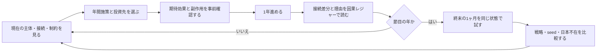
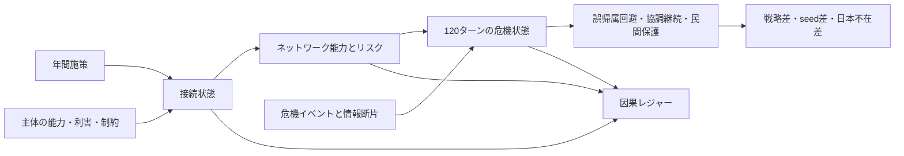

# プロダクト設計｜2045年に日本を外すためのシミュレーター

## 1. この文書の役割

この文書は、作品のゴールを実装へ変換する設計正本である。

- [simulation-contract.md](../simulation-contract.md): 実験上、何を比較してよいか
- 本文書: 状態、因果、画面、モジュールをどう構成するか
- [ROADMAP.md](../ROADMAP.md): どの順序で、どの証拠を揃えて作るか
- [RESULTS.md](../RESULTS.md): 現在の実装から実際に観測できたこと

数値係数、実在組織の行動、危機の発生確率を正本化する文書ではない。

## 2. プロダクトゴール

2026〜2045年に育てた接続が「終末の1ヶ月」でどう働き、2045年に日本を中央から外した後も協調が続くかを、同条件の比較と因果ログで反証可能にする。

成功は日本の中心性ではなく、次の同時成立で判定する。

1. 検証前の攻撃帰属が不可逆行動を先回りしにくい。
2. 通信、検証、復旧、対話に代替経路がある。
3. 民間サービスと異論の記録が危機中も残る。
4. 権力集中、監視化、単一依存、過剰開示が許容範囲を超えない。
5. 日本ノードを外しても、第三者が接続を運用できる。

## 3. プレイヤーの役割と主ループ

プレイヤーは危機時の司令官ではなく、20年間の接続設計者である。



一回の年次判断で必ず表示するものは、`選んだ施策`、`投資先の接続`、`変化前後`、`変化理由`、`副作用`、`危機結果への寄与候補`である。

## 4. 因果モデル

作品の中心はスコアではなく、次の因果鎖である。



UI上の線、指標、判定はすべてこの状態から導出する。描画用の固定値を別の正本にしない。

## 5. 状態オブジェクト

### 5.1 Actor

| フィールド | 意味 |
|---|---|
| `id / group / role` | 国ではなく公開役割を抽象化した識別 |
| `capabilities` | 検証、外交、法執行、研究、インフラなど |
| `incentives` | 何を守ると評価されるか |
| `constraints` | 法、同盟、国内説明、機密、予算、時間 |
| `evidenceAccess` | 取得できる証拠の種類、遅延、確信度 |
| `decisionRights` | 提案、検証、承認、実行、拒否の権限 |
| `fatigue / legitimacy` | 長期危機で変動する内部余力 |

国籍は挙動を直接決めない。同じ役割・制約型は国をまたいで再利用する。

### 5.2 Relationship

| フィールド | 意味 |
|---|---|
| `source / target / purpose / channel` | 誰が、何のために、どの回線でつながるか |
| `maturity / trust` | 運用経験と限定的な信頼 |
| `verificationAgreement` | 証拠型、確信度、反証条件を共有できるか |
| `interoperability` | 制度・技術・手順を接続して動かせるか |
| `coOwnership` | 日本以外が運用・変更・監査できるか |
| `dependency / alternateRoutes` | 単一障害点と代替経路 |
| `disclosureCost` | 機密、知財、個人情報の開示負担 |
| `lastChangedBy / changeReason` | 因果レジャーへの追跡情報 |

### 5.3 Evidence item

すべての情報を `fact | claim | inference | proposal` に分離し、`sourceActor`、`observedAt`、`confidence`、`provenance`、`counterEvidence`、`expiresAt` を持たせる。真因はワールドエンジンだけが保持し、各主体へ同じ追加情報を与えない。

### 5.4 Ledger entry

```text
id / year / crisisTurn
causeType / causeId
targetType / targetId
before / after / delta
reason / tradeoff
evidenceIds / ruleVersion / seed
```

総合指標、接続線、危機判定のどこからでも、元のレジャーへ逆引きできることを必須にする。

## 6. 「終末の1ヶ月」エンジン

30日を6時間単位、全120ターンで進める。年次能力は危機中に成長させず、開始時点のスナップショットとして固定する。

| 局面 | 主な圧力 | 観測する接続 |
|---|---|---|
| 1. 接触 | 海上接触、測位異常、断片映像 | 海上法執行、証拠保全 |
| 2. 帰属競争 | DDoS、リーク、公開声明 | 検証、翻訳、PUBLIC回線 |
| 3. 警戒上昇 | 同盟要請、軍事警戒、保険料上昇 | ALLIANCE、JP-CN、可逆化 |
| 4. 持久 | 要員疲労、補給、世論圧力 | 代替経路、国内正統性 |
| 5. 連鎖障害 | 港湾、金融、通信、エネルギー | 民間復旧、相互運用性 |
| 6. 出口形成 | 共同停止、第三者検証、面子 | MULTI、共同所有 |
| 7. 復旧・検証 | 訂正、補償、再発防止 | 異論保存、BRIDGE自律性 |

各ターンは `world event → observation → claim → proposal → authorized action → consequence → ledger` の順で処理する。発話だけで状態を変更しない。

## 7. 比較と反証

比較条件A〜Eは、同じ初期状態、seed、予算、行動回数、危機イベント列を使う。変えてよいのは接続投資と意思決定構造だけである。

最低限の反証試験は次の通り。

- `Japan removal`: 2045年に日本の中央・検証ノードを停止する。
- `Bridge capture`: BRIDGEが一陣営へ依存する。
- `Channel loss`: ALLIANCE、JP-CN、VERIFYの一つを遮断する。
- `False consensus`: 共有状況図が誤った多数意見を固定する。
- `Domestic fatigue`: 日本国内の正統性と要員余力を下げる。
- `Disclosure shock`: 共同検証の開示コストを上げる。

網状調整Dが常に勝つ設計は禁止する。条件Eや単純な分断が勝つseedを記録し、仮説を縮小・棄却する材料にする。

## 8. 画面設計

画面の主役は「ネットワーク」ではなく、**接続が変わった理由**である。既存の公共インフラ検証室という視覚方向を維持し、軍事司令室や汎用SaaSダッシュボードへ寄せない。

### 常時表示

- 上: 2026〜2045年の時間軸と、現在年の次行動
- 左: 主体一覧と制約の概要
- 中央: 接続グラフ。線の状態はRelationshipから描画
- 右: 選択した接続の目的、状態、副作用、次の成熟条件
- 下: 年間施策、直近の因果レジャー、節目の危機結果

### 段階的開示

初期画面で18主体、20接続、全指標、危機詳細を同じ強さで見せない。通常時は「今年の投資先」と「直近の変化」を主役にし、アクター詳細、全ログ、比較、120ターン再生は選択後に開く。

### 署名的な表現

接続を選ぶと、線が光るだけでなく、`2029 信頼 42→49`のような差分が線上から因果レジャーへ流れる。一つの強い動きに限定し、常時アニメーションは避ける。`prefers-reduced-motion`では静的な差分表示へ切り替える。

## 9. 実装境界

現在の`simulation.js`を、状態の正本を保ったまま次へ分割する。

```text
app/src/simulation/
  constants.js       年、危機期間、共通列挙
  actors.js          主体定義と制約型
  relationships.js   接続定義と初期状態
  actions.js         年次施策と適格性
  engine.js          年次状態遷移
  crisis.js          120ターン危機エンジン
  evaluation.js      能力、リスク、反証評価
  ledger.js          因果レジャー生成と逆引き
  scenarios.js       A〜E、seed、障害注入
  schema.js          状態versionとmigration
```

Reactはユーザー操作と表示を担当し、数値更新を持たない。AIエージェント層を追加する場合も、提案を決定論コアへ渡すadapterとし、権限・予算・状態遷移を直接変更させない。

## 10. 検証階層

1. 状態不変条件: 範囲、予算、権限、同一seed再現性
2. 接続単体: 施策、適格性、副作用、レジャー
3. 年次系列: 2026〜2045年、疲労、制度移管
4. 危機系列: 120ターン、遮断、訂正、復旧
5. 反証: A〜E、複数seed、日本除去、係数感度
6. UI: キーボード、色以外の区別、狭幅、reduced motion
7. 公開境界: 架空係数、出典、個人パス、秘密情報、依存監査

## 11. 研究と公式資料の境界

危機協調研究で繰り返し扱われる、事前関係、共有状況認識、冗長経路、柔軟性、継続的訓練は、状態変数候補の妥当性確認にだけ使う。研究結果を係数、国別性格、政策効果へ直接変換しない。

概念原典と公式URLの公開境界は変更しない。学術文献を公開参考文献へ追加する場合は、再利用権、要約範囲、原典との関係を別レビューする。

## 12. 完成の定義

最終作品は、評価者が次の問いへログから答えられた時に完成する。

- 何へ投資したため、どの接続が変わったか。
- その変化はどの主体の制約を受け、何を悪化させたか。
- 終末の1ヶ月の何ターン目に、その接続が効いた、または壊れたか。
- 同じ危機で別戦略なら何が変わったか。
- 日本を外した後に誰が運用を引き継ぎ、どこが止まったか。
- どのseed・係数・障害条件で中心仮説が反転したか。
